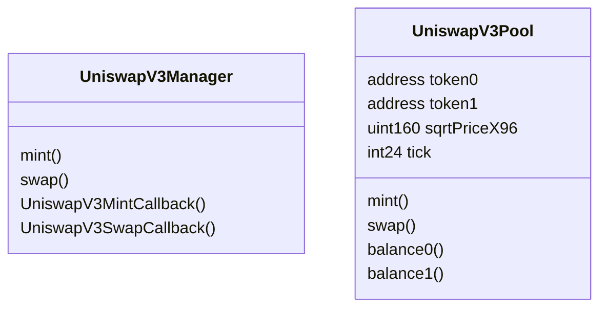
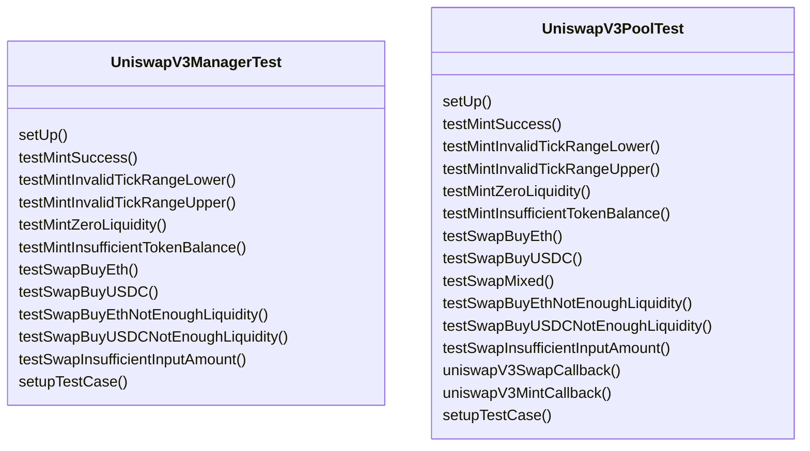

# Uniswap V3 Book

Learning Uniswap V3 in [this book](https://uniswapv3book.com/)

## env

Using [foundry]() and developed on Docker Desktop

```bash
docker pull ghcr.io/foundry-rs/foundry:latest
```

VSC formatter is [hardhat-solidity](https://marketplace.visualstudio.com/items?itemName=NomicFoundation.hardhat-solidity)

```bash
code --install-extension NomicFoundation.hardhat-solidity
```

## memo

When installing prb-math library, need commit number

```bash
forge install paulrberg/prb-math@e33a042
```

not

```bash
forge install paulrberg/prb-math
```




